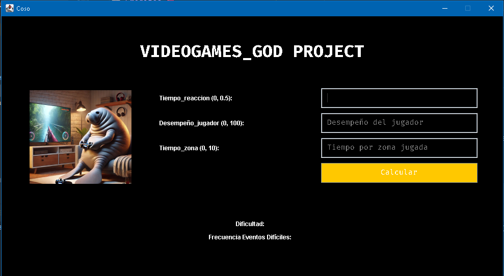

# Fuzzy Game Project 🎮

## Descripción 📖
**Fuzzy Game** es una aplicación basada en lógica difusa que calcula la **dificultad del juego** y la **frecuencia de eventos difíciles** utilizando un sistema de inferencia difusa. Los usuarios pueden ingresar valores relacionados con el tiempo de reacción, el desempeño del jugador y el tiempo por zona jugada, y recibir resultados en tiempo real a través de una interfaz gráfica intuitiva y atractiva.

Este proyecto utiliza la biblioteca **jFuzzyLogic** para implementar el sistema de inferencia difusa y se centra en ofrecer una experiencia interactiva y visual.

---

## Características 🚀
- Implementación de lógica difusa mediante **jFuzzyLogic**.
- Interfaz gráfica basada en **Swing** con un diseño moderno y funcional.
- Validación de entradas para asegurar valores dentro de rangos definidos:
  - `Tiempo de reacción`: \(0 \leq x \leq 0.5\)
  - `Desempeño del jugador`: \(0 \leq x \leq 100\)
  - `Tiempo por zona`: \(0 \leq x \leq 10\)
- Mensajes de error claros para entradas no válidas.
- Resultados calculados:
  - **Dificultad del juego**.
  - **Frecuencia de eventos difíciles**.

---

## Requisitos del Sistema ⚙️
### Dependencias
- **Java 8 o superior**: Requerido para ejecutar el proyecto.
- **jFuzzyLogic**: Biblioteca para la implementación de lógica difusa.
- **Swing**: Incluido en el JDK para construir la interfaz gráfica.

---

## Estructura del Proyecto 🗂️
```
fuzzy_game/
├── src/
│   ├── game_fis/
│   │   ├── Game_FIS.java  # Lógica difusa (carga y evaluación del sistema)
│   │   └── game_FCL.fcl   # Archivo de lógica difusa (definición de reglas)
│   ├── gui/
│   │   └── Coso.java       # Interfaz gráfica del usuario
│   └── images/
│       └── lapoderosa.jpg  # Imagen decorativa
├── README.md               # Documentación del proyecto
└── pom.xml (opcional)      # Configuración de Maven (si es necesario)
```

---

## Instalación y Ejecución 🖥️

### 1. Clonar el repositorio
```bash
git clone https://github.com/Und3rW0rld/fuzzy_game.git
cd fuzzy_game
```

### 2. Compilar y ejecutar
1. Compila el proyecto:
   ```bash
   javac -d bin src/**/*.java
   ```
2. Ejecuta la aplicación:
   ```bash
   java -cp "bin:lib/jfuzzylogic.jar" gui.Coso
   ```

---

## Uso 📋

1. Ingresa los valores en los campos correspondientes:
   - **Tiempo de reacción**: Entre 0 y 0.5.
   - **Desempeño del jugador**: Entre 0 y 100.
   - **Tiempo por zona**: Entre 0 y 10.
2. Haz clic en el botón **Calcular**.
3. Los resultados aparecerán debajo, indicando:
   - **Dificultad del juego**.
   - **Frecuencia de eventos difíciles**.

### Ejemplo de Entradas y Salidas
| Entrada                  | Resultado                                |
|--------------------------|------------------------------------------|
| Tiempo de reacción: 0.3  | Dificultad: `45.67`                     |
| Desempeño del jugador: 80| Frecuencia de eventos difíciles: `4.89` |
| Tiempo por zona: 5       |                                          |

---

## Contribuciones 🤝
¡Contribuciones son bienvenidas! Por favor:
1. Crea un fork del repositorio.
2. Trabaja en una rama separada.
3. Abre un Pull Request describiendo tus cambios.

---

## Licencia 📜
Este proyecto está licenciado bajo la **MIT License**. Consulta el archivo `LICENSE` para más detalles.

---

## Créditos ❤️
- **Autor**: [Und3rW0rld](https://github.com/Und3rW0rld)
- **Imagen decorativa**: "lapoderosa.jpg".

---

## Contacto ✉️
Si tienes alguna pregunta o sugerencia, no dudes en contactarme a través de mi perfil de GitHub.

¡Gracias por visitar este proyecto y espero que te sea útil! 😊
